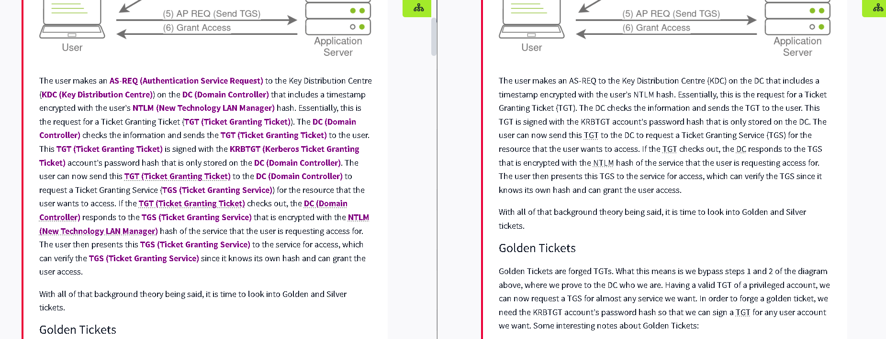

# 🔍 TryHackMe Acronym Expander

A Tampermonkey script that automatically expands security-related acronyms on TryHackMe, making learning easier for beginners by expanding common security terms inline.

## 🌟 Features

- **Instant Expansion**: Automatically detects and expands common security acronyms
- **Visual Highlighting**: Displays expansions in purple and bold for easy identification
- **Non-Intrusive**: Preserves original page content and formatting
- **Dynamic Updates**: Works with dynamically loaded content
- **Performance Optimized**: Minimal impact on page load times

## 📋 Currently Supported Acronyms

| Acronym | Expansion |
|---------|-----------|
| AS-REQ | Authentication Service Request |
| KDC | Key Distribution Centre |
| DC | Domain Controller |
| NTLM | New Technology LAN Manager |
| TGT | Ticket Granting Ticket |
| KRBTGT | Kerberos Ticket Granting Ticket |
| TGS | Ticket Granting Service |

## 🚀 Installation

1. Install [Tampermonkey](https://www.tampermonkey.net/) browser extension
2. Click [here](https://github.com/pentestfunctions/tryhackme-acronyms/raw/main/acronym_expander.js) to install the script
   - Or create a new Tampermonkey script and copy the contents of `acronym_expander.js`

## 💡 Usage

1. Navigate to any TryHackMe page
2. Acronyms will automatically be expanded and highlighted in purple
3. No additional configuration needed!

---

A tool to make TryHackMe content more accessible for new learners

